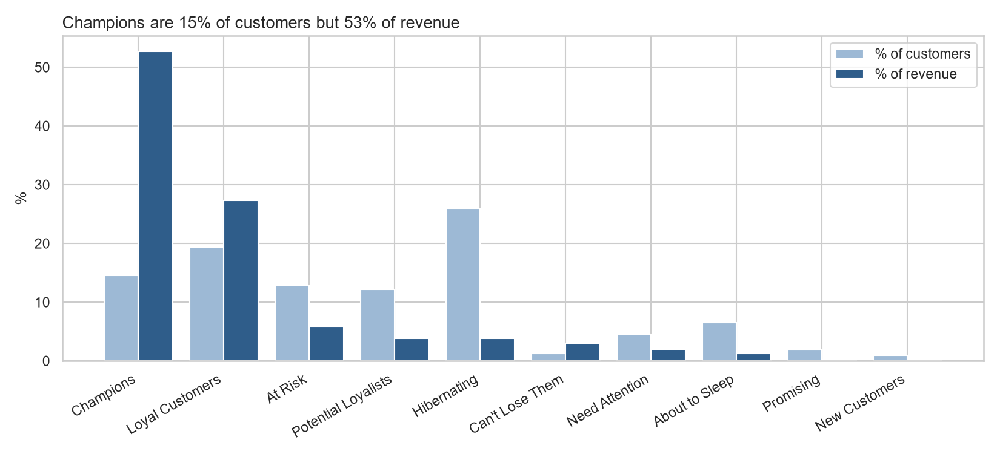
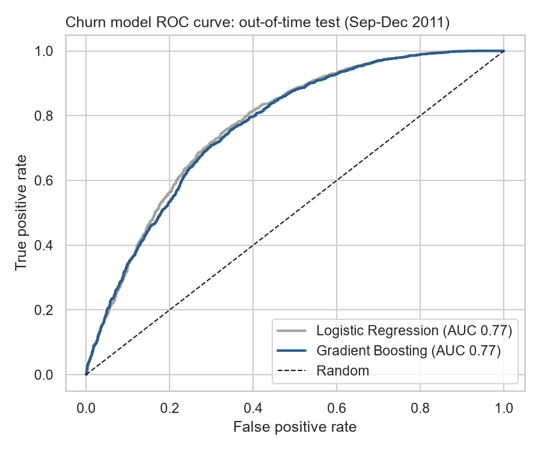
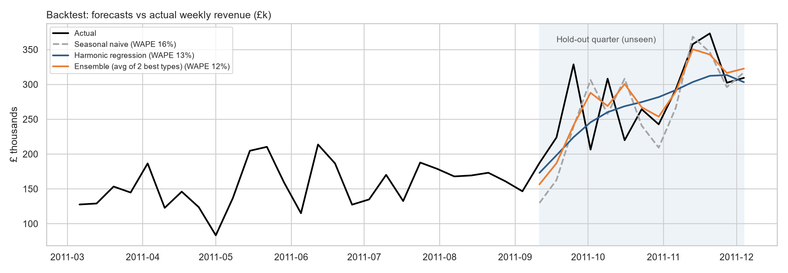
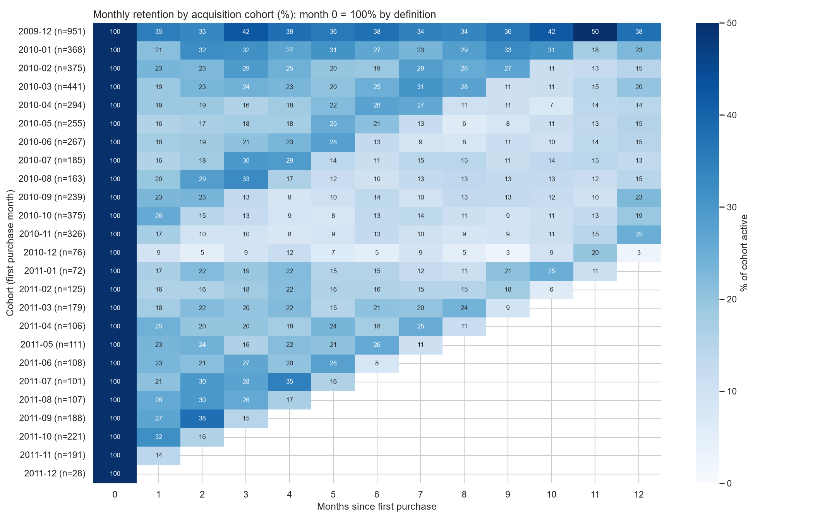
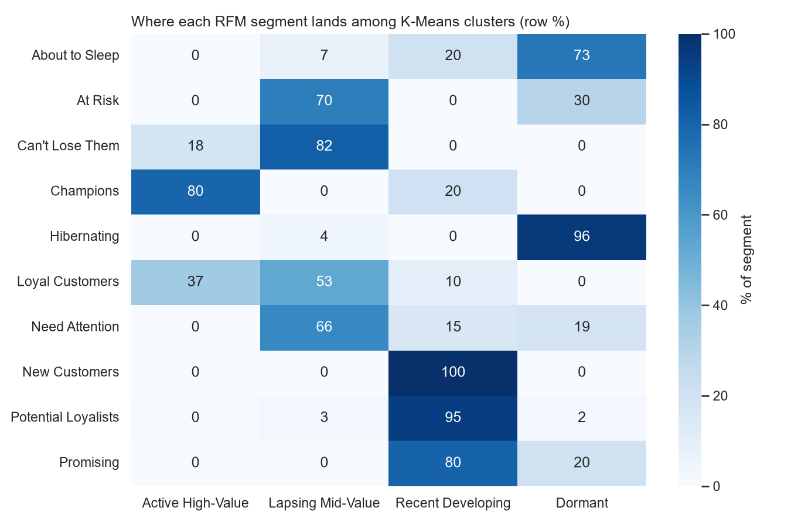
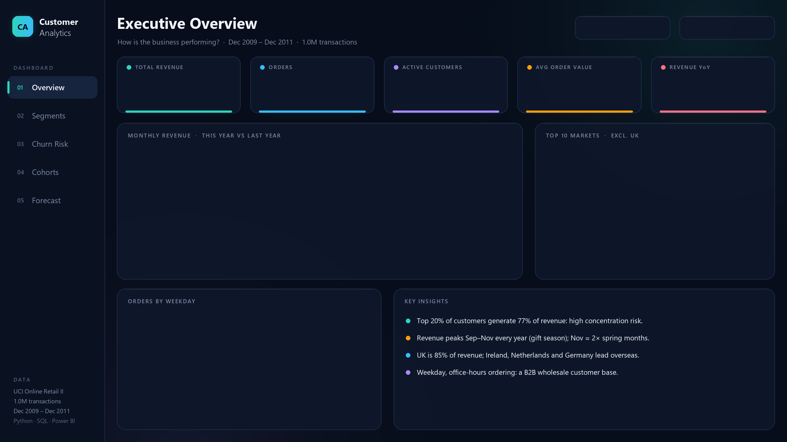

# Customer Segmentation, Churn Prediction & Revenue Forecasting
### End-to-end customer analytics on 1M+ e-commerce transactions: Python · SQL · Machine Learning · Power BI

**Business question:** *Which customers drive value, which are about to leave, and what revenue should we expect next quarter?*

**Data:** [UCI Online Retail II](https://archive.ics.uci.edu/dataset/502/online+retail+ii): 1,067,371 transactions from a UK online gift wholesaler, Dec 2009 – Dec 2011 (£19.3M revenue, 5,852 customers, 43 countries).

---

## Key results

| Area | Result |
|---|---|
| **Revenue concentration** | Top 20% of customers generate **77%** of revenue; **Champions** (15% of customers) generate **53%** |
| **Revenue at risk** | 828 "At Risk / Can't Lose" customers hold **£1.47M** of historic spend |
| **Retention** | Only **21%** of new customers return the next month; repeat buyers spend **11×** more than one-time buyers |
| **Churn model** | ROC-AUC **0.77** on an unseen future quarter; riskiest 10% churn at **1.6×** the average rate → **£442K** revenue at risk next quarter, ranked into a call list |
| **Forecast** | Next-quarter forecast with 80% intervals; backtest error **12% WAPE** vs 47% for a naive forecast, **−0.9%** bias |
| **SQL ↔ Python** | RFM rebuilt in SQL; R, F, M reconcile **100%** with Python |



## What's inside

| # | Notebook | Techniques |
|---|---|---|
| 01 | [Data cleaning & EDA](notebooks/01_data_cleaning_eda.ipynb) | Data quality audit, cleaning rules, Pareto analysis, seasonality |
| 02 | [RFM segmentation](notebooks/02_rfm_segmentation.ipynb) | Quintile scoring, 10 business segments, action plan |
| 03 | [K-Means clustering](notebooks/03_kmeans_clustering.ipynb) | Log-scaling, elbow + silhouette, PCA, validation vs RFM |
| 04 | [Cohort retention](notebooks/04_cohort_retention.ipynb) | Acquisition cohorts, retention heatmap |
| 05 | [Churn & value model](notebooks/05_churn_clv_model.ipynb) | Point-in-time features, out-of-time validation, logistic regression vs gradient boosting, calibration, permutation importance, baseline benchmarking |
| 06 | [Revenue forecast](notebooks/06_revenue_forecast.ipynb) | Baselines, harmonic (Fourier) regression, AIC model selection, ensemble, prediction intervals |
| 07 | [SQL & Power BI export](notebooks/07_sql_and_powerbi_export.ipynb) | SQLite, CTEs, window functions (NTILE, LAG), reconciliation, star schema |
| — | [SQL queries](sql/rfm_analysis.sql) | RFM, segment summary, MoM growth, repeat rate by country |
| — | [Power BI dashboard](powerbi/) | 5 pages: Overview · Segments · Churn Risk · Cohorts · Forecast |
| — | [Executive summary](reports/executive_summary.md) | 1-page findings, recommendations, assumptions & limitations |

## Selected visuals

| Churn model: out-of-time ROC | Forecast backtest |
|---|---|
|  |  |

| Cohort retention | RFM vs K-Means agreement |
|---|---|
|  |  |

## Power BI dashboard (in progress)
Five-page dark-theme dashboard (Overview · Segments · Churn Risk · Cohorts · Forecast) built on a star schema with DAX measures. Page design preview:



## Methodology highlights
- **No data leakage:** churn features built only from data *before* each cutoff date; labels from the 90 days *after*; tested on a later, unseen quarter.
- **Every model beats (or is compared to) a baseline.** Where ML didn't beat a simple rule (customer-value regression), the simpler method was deployed.
- **Explainability first:** logistic regression chosen over gradient boosting at equal accuracy; drivers shown with permutation importance.
- **Honest uncertainty:** forecast ranges, calibration check, and a documented assumptions/limitations section in every notebook.

## How to run
```bash
pip install -r requirements.txt
# download online_retail_II.xlsx from UCI into data/raw/, then run notebooks 01 → 07 in order
```

## Tools
Python (pandas, NumPy, scikit-learn, statsmodels, matplotlib, seaborn) · SQL (SQLite) · Power BI (DAX, Power Query, star schema) · Jupyter
